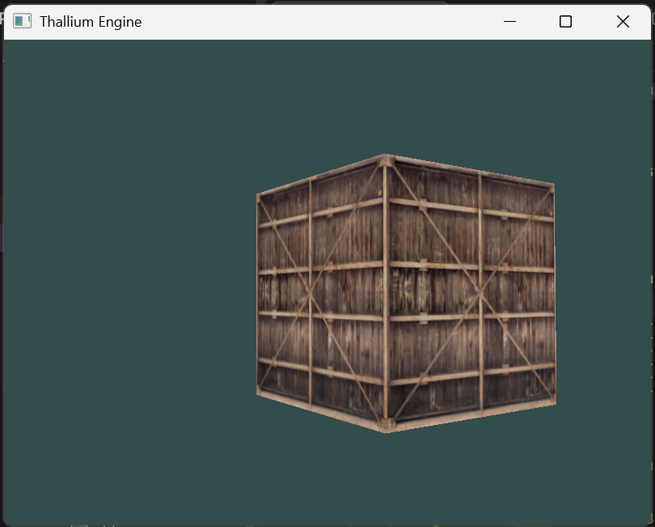
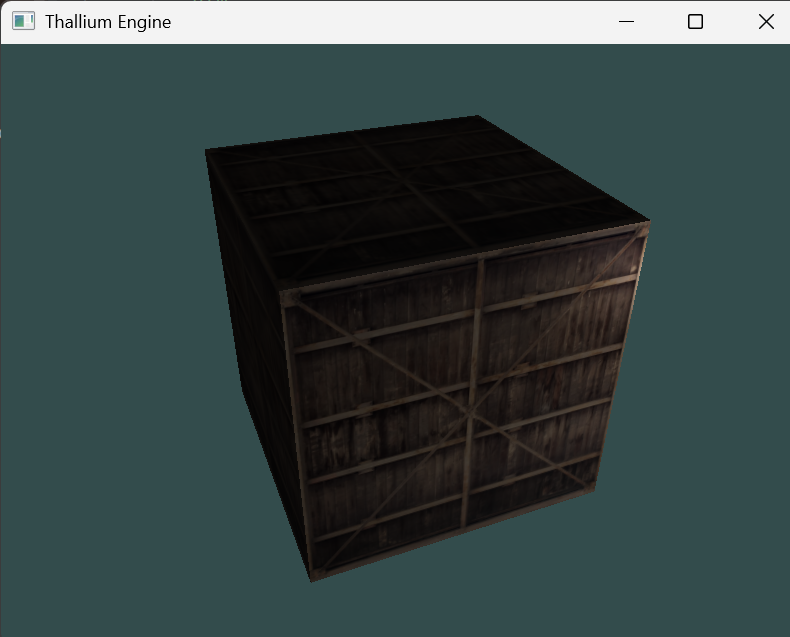

# Thallium Engine
Thallium is a graphics engine written in C++ using OpenGL.

**Dependencies:**  
- `glad`  
- `glfw`  
- `glm`  
- `stb_image`  
- `opengl`

By default, these are all included in the `thirdparty` folder, except for OpenGL, which is provided by MSVC (my compiler).
Currently, this project will take some modification to support compilers other than MSVC and therefore platforms other than Windows.  

# Screenshots
**v0.0.1**  
  
**v0.0.2**  
